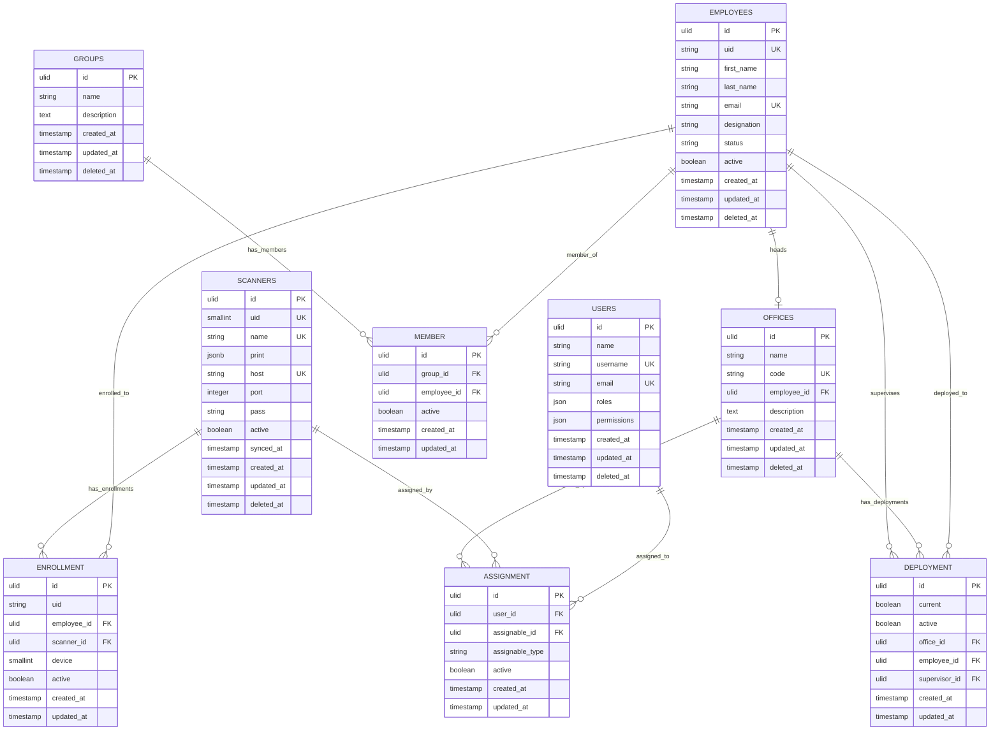
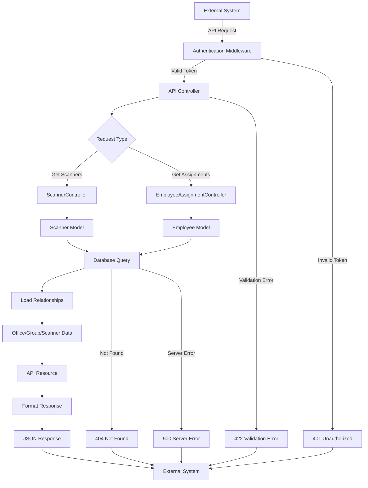
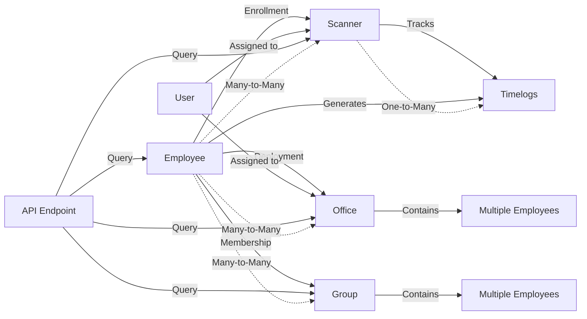
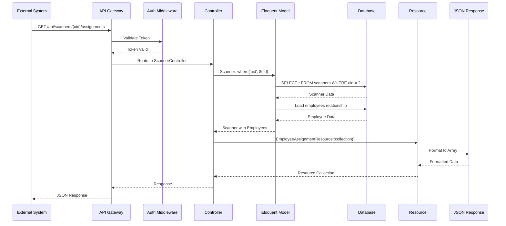
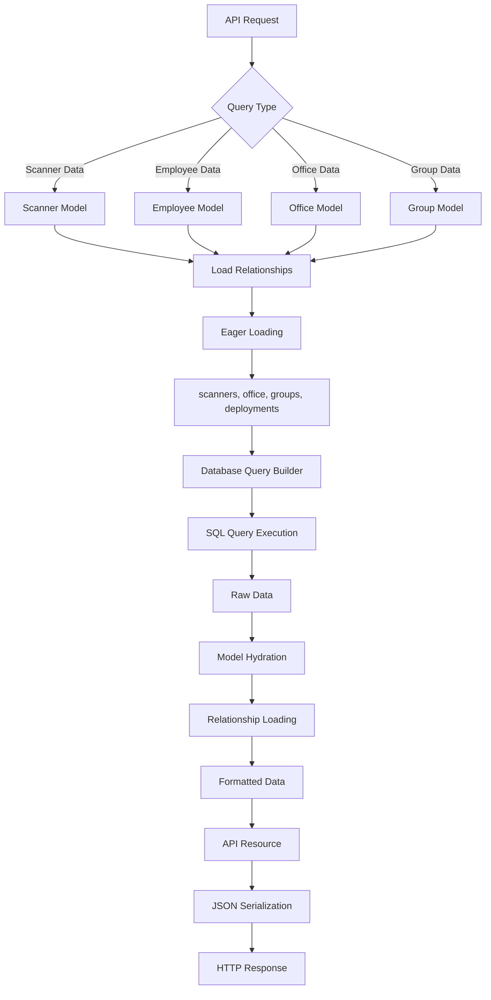

# Office Groups Scanner Integration Guide

## Overview

This guide provides step-by-step instructions for creating API endpoints to integrate with your existing office groups scanner system. The integration will allow you to pull employee assignment data from this system without creating new records.

## System Architecture

### Core Models and Relationships

The system has the following key models:

1. **Employee** - Core employee data with UID for scanner identification
2. **Scanner** - Physical scanner devices with unique UIDs
3. **Enrollment** - Pivot table linking employees to scanners
4. **Office** - Organizational units
5. **Group** - Employee groups within offices
6. **Deployment** - Employee-office assignments
7. **Member** - Employee-group memberships

### Entity Relationship Diagram (ERD)



### Database Structure

```sql
-- Core Tables
employees (id, uid, first_name, last_name, email, status, active, ...)
scanners (id, uid, name, host, port, active, ...)
enrollment (id, employee_id, scanner_id, uid, device, active)
offices (id, name, code, employee_id, ...)
groups (id, name, description)
deployment (id, office_id, employee_id, supervisor_id, current, active)
member (id, group_id, employee_id, active)
```

## Integration Steps

### Step 1: Create API Controllers

Create new API controllers to handle scanner and employee data retrieval:

#### 1.1 Scanner Controller
```bash
php artisan make:controller Api/ScannerController
```

#### 1.2 Employee Assignment Controller
```bash
php artisan make:controller Api/EmployeeAssignmentController
```

### Step 2: Create API Resources

Create resource classes to format API responses:

#### 2.1 Scanner Resource
```bash
php artisan make:resource ScannerResource
```

#### 2.2 Employee Assignment Resource
```bash
php artisan make:resource EmployeeAssignmentResource
```

### Step 3: Implement Scanner Endpoints

#### 3.1 ScannerController Implementation

```php
<?php

namespace App\Http\Controllers\Api;

use App\Http\Controllers\Controller;
use App\Http\Resources\ScannerResource;
use App\Models\Scanner;
use Illuminate\Http\Request;
use Illuminate\Http\Resources\Json\AnonymousResourceCollection;

class ScannerController extends Controller
{
    /**
     * Get all active scanners
     */
    public function index(Request $request): AnonymousResourceCollection
    {
        $scanners = Scanner::query()
            ->where('active', true)
            ->with(['employees', 'users'])
            ->get();

        return ScannerResource::collection($scanners);
    }

    /**
     * Get scanner by UID
     */
    public function show(Request $request, string $uid): ScannerResource
    {
        $scanner = Scanner::query()
            ->where('uid', $uid)
            ->where('active', true)
            ->with(['employees', 'users'])
            ->firstOrFail();

        return new ScannerResource($scanner);
    }

    /**
     * Get scanner assignments (employees enrolled to scanner)
     */
    public function assignments(Request $request, string $uid): AnonymousResourceCollection
    {
        $scanner = Scanner::query()
            ->where('uid', $uid)
            ->where('active', true)
            ->firstOrFail();

        $employees = $scanner->employees()
            ->with(['office', 'groups'])
            ->get();

        return EmployeeAssignmentResource::collection($employees);
    }
}
```

#### 3.2 ScannerResource Implementation

```php
<?php

namespace App\Http\Resources;

use Illuminate\Http\Request;
use Illuminate\Http\Resources\Json\JsonResource;

class ScannerResource extends JsonResource
{
    public function toArray(Request $request): array
    {
        return [
            'id' => $this->id,
            'uid' => $this->uid,
            'name' => $this->name,
            'host' => $this->host,
            'port' => $this->port,
            'active' => $this->active,
            'synced_at' => $this->synced_at?->toISOString(),
            'employee_count' => $this->employees->count(),
            'assigned_users' => $this->users->pluck('name'),
            'print_settings' => $this->print,
        ];
    }
}
```

### Step 4: Implement Employee Assignment Endpoints

#### 4.1 EmployeeAssignmentController Implementation

```php
<?php

namespace App\Http\Controllers\Api;

use App\Http\Controllers\Controller;
use App\Http\Resources\EmployeeAssignmentResource;
use App\Models\Employee;
use App\Models\Office;
use App\Models\Group;
use Illuminate\Http\Request;
use Illuminate\Http\Resources\Json\AnonymousResourceCollection;

class EmployeeAssignmentController extends Controller
{
    /**
     * Get employees by office
     */
    public function byOffice(Request $request, string $officeCode): AnonymousResourceCollection
    {
        $office = Office::query()
            ->where('code', $officeCode)
            ->firstOrFail();

        $employees = $office->employees()
            ->with(['scanners', 'groups', 'currentDeployment'])
            ->get();

        return EmployeeAssignmentResource::collection($employees);
    }

    /**
     * Get employees by group
     */
    public function byGroup(Request $request, string $groupId): AnonymousResourceCollection
    {
        $group = Group::query()
            ->where('id', $groupId)
            ->firstOrFail();

        $employees = $group->employees()
            ->with(['scanners', 'office', 'currentDeployment'])
            ->get();

        return EmployeeAssignmentResource::collection($employees);
    }

    /**
     * Get employee scanner assignments
     */
    public function scannerAssignments(Request $request, string $employeeUid): AnonymousResourceCollection
    {
        $employee = Employee::query()
            ->where('uid', $employeeUid)
            ->where('active', true)
            ->firstOrFail();

        $scanners = $employee->scanners()
            ->with(['users'])
            ->get();

        return ScannerResource::collection($scanners);
    }

    /**
     * Get all employee assignments with filters
     */
    public function index(Request $request): AnonymousResourceCollection
    {
        $query = Employee::query()
            ->where('active', true)
            ->with(['scanners', 'office', 'groups', 'currentDeployment']);

        // Filter by office
        if ($request->has('office_code')) {
            $query->whereHas('office', function ($q) use ($request) {
                $q->where('code', $request->office_code);
            });
        }

        // Filter by group
        if ($request->has('group_id')) {
            $query->whereHas('groups', function ($q) use ($request) {
                $q->where('groups.id', $request->group_id);
            });
        }

        // Filter by scanner
        if ($request->has('scanner_uid')) {
            $query->whereHas('scanners', function ($q) use ($request) {
                $q->where('scanners.uid', $request->scanner_uid);
            });
        }

        $employees = $query->get();

        return EmployeeAssignmentResource::collection($employees);
    }
}
```

#### 4.2 EmployeeAssignmentResource Implementation

```php
<?php

namespace App\Http\Resources;

use Illuminate\Http\Request;
use Illuminate\Http\Resources\Json\JsonResource;

class EmployeeAssignmentResource extends JsonResource
{
    public function toArray(Request $request): array
    {
        return [
            'id' => $this->id,
            'uid' => $this->uid,
            'name' => $this->name,
            'full_name' => $this->full_name,
            'email' => $this->email,
            'designation' => $this->designation,
            'status' => $this->status->value,
            'active' => $this->active,
            
            // Office assignment
            'office' => $this->whenLoaded('office', [
                'id' => $this->office->id,
                'name' => $this->office->name,
                'code' => $this->office->code,
            ]),
            
            // Current deployment
            'deployment' => $this->whenLoaded('currentDeployment', [
                'office_id' => $this->currentDeployment->office_id,
                'supervisor_id' => $this->currentDeployment->supervisor_id,
                'current' => $this->currentDeployment->current,
            ]),
            
            // Group memberships
            'groups' => $this->whenLoaded('groups', function () {
                return $this->groups->map(function ($group) {
                    return [
                        'id' => $group->id,
                        'name' => $group->name,
                    ];
                });
            }),
            
            // Scanner enrollments
            'scanners' => $this->whenLoaded('scanners', function () {
                return $this->scanners->map(function ($scanner) {
                    return [
                        'id' => $scanner->id,
                        'uid' => $scanner->uid,
                        'name' => $scanner->name,
                        'host' => $scanner->host,
                        'enrollment_uid' => $scanner->pivot->uid,
                    ];
                });
            }),
        ];
    }
}
```

### Step 5: Add API Routes

Add the new routes to `routes/api.php`:

```php
<?php

use App\Http\Controllers\Api\ScannerController;
use App\Http\Controllers\Api\EmployeeAssignmentController;

Route::middleware(['auth:sanctum', ForceAcceptJson::class])->group(function () {
    // Existing routes...
    
    // Scanner endpoints
    Route::prefix('scanners')->group(function () {
        Route::get('/', [ScannerController::class, 'index']);
        Route::get('/{uid}', [ScannerController::class, 'show']);
        Route::get('/{uid}/assignments', [ScannerController::class, 'assignments']);
    });
    
    // Employee assignment endpoints
    Route::prefix('assignments')->group(function () {
        Route::get('/', [EmployeeAssignmentController::class, 'index']);
        Route::get('/office/{officeCode}', [EmployeeAssignmentController::class, 'byOffice']);
        Route::get('/group/{groupId}', [EmployeeAssignmentController::class, 'byGroup']);
        Route::get('/employee/{employeeUid}/scanners', [EmployeeAssignmentController::class, 'scannerAssignments']);
    });
});
```

### Step 6: Create Request Validation Classes

#### 6.1 Scanner Request Validation

```bash
php artisan make:request ScannerRequest
```

```php
<?php

namespace App\Http\Requests;

use Illuminate\Foundation\Http\FormRequest;

class ScannerRequest extends FormRequest
{
    public function authorize(): bool
    {
        return true;
    }

    public function rules(): array
    {
        return [
            'uid' => 'sometimes|string|max:255',
            'office_code' => 'sometimes|string|max:255',
            'group_id' => 'sometimes|string|max:255',
        ];
    }
}
```

### Step 7: API Usage Examples

#### 7.1 Get All Scanners
```bash
GET /api/scanners
Authorization: Bearer {token}
```

#### 7.2 Get Scanner by UID
```bash
GET /api/scanners/{scanner_uid}
Authorization: Bearer {token}
```

#### 7.3 Get Scanner Assignments
```bash
GET /api/scanners/{scanner_uid}/assignments
Authorization: Bearer {token}
```

#### 7.4 Get Employees by Office
```bash
GET /api/assignments/office/{office_code}
Authorization: Bearer {token}
```

#### 7.5 Get Employees by Group
```bash
GET /api/assignments/group/{group_id}
Authorization: Bearer {token}
```

#### 7.6 Get Employee Scanner Assignments
```bash
GET /api/assignments/employee/{employee_uid}/scanners
Authorization: Bearer {token}
```

#### 7.7 Filtered Employee Assignments
```bash
GET /api/assignments?office_code=IT&group_id=123&scanner_uid=456
Authorization: Bearer {token}
```

### Step 8: Authentication Setup

Ensure your API uses Sanctum authentication. The existing system already has this configured in `routes/api.php`.

### Step 9: Testing the Integration

#### 9.1 Test Scanner Endpoints
```bash
# Test scanner listing
curl -H "Authorization: Bearer {token}" \
     -H "Accept: application/json" \
     http://your-domain/api/scanners

# Test specific scanner
curl -H "Authorization: Bearer {token}" \
     -H "Accept: application/json" \
     http://your-domain/api/scanners/123
```

#### 9.2 Test Employee Assignment Endpoints
```bash
# Test office assignments
curl -H "Authorization: Bearer {token}" \
     -H "Accept: application/json" \
     http://your-domain/api/assignments/office/IT

# Test filtered assignments
curl -H "Authorization: Bearer {token}" \
     -H "Accept: application/json" \
     "http://your-domain/api/assignments?office_code=IT&scanner_uid=123"
```

## Data Flow

### API Integration Flowchart



### Employee-Scanner Assignment Flow



### API Request Flow



### Database Query Flow



## Data Flow Summary

1. **External System** → **API Endpoint** → **Controller** → **Model** → **Database**
2. **Database** → **Model** → **Resource** → **Controller** → **JSON Response** → **External System**

## Key Features

- **Read-Only Access**: All endpoints are GET requests, no data modification
- **Flexible Filtering**: Filter by office, group, scanner, or employee
- **Relationship Loading**: Includes related data (office, groups, scanners)
- **Authentication**: Uses existing Sanctum token authentication
- **Resource Formatting**: Clean, consistent JSON responses

## Security Considerations

1. **Authentication Required**: All endpoints require valid Sanctum token
2. **Read-Only**: No data modification capabilities
3. **Input Validation**: Request validation for all parameters
4. **Rate Limiting**: Consider implementing rate limiting for production

## Error Handling

The system will return appropriate HTTP status codes:
- `200` - Success
- `401` - Unauthorized (invalid/missing token)
- `404` - Resource not found
- `422` - Validation errors
- `500` - Server errors

## Next Steps

1. Implement the controllers and resources as outlined
2. Add the routes to your API
3. Test the endpoints with your external system
4. Consider adding caching for frequently accessed data
5. Implement logging for API usage monitoring
6. Add API documentation (consider using Laravel API Documentation tools)

This integration provides a clean, secure way to pull employee and scanner assignment data from your existing system without modifying the core data structure.
